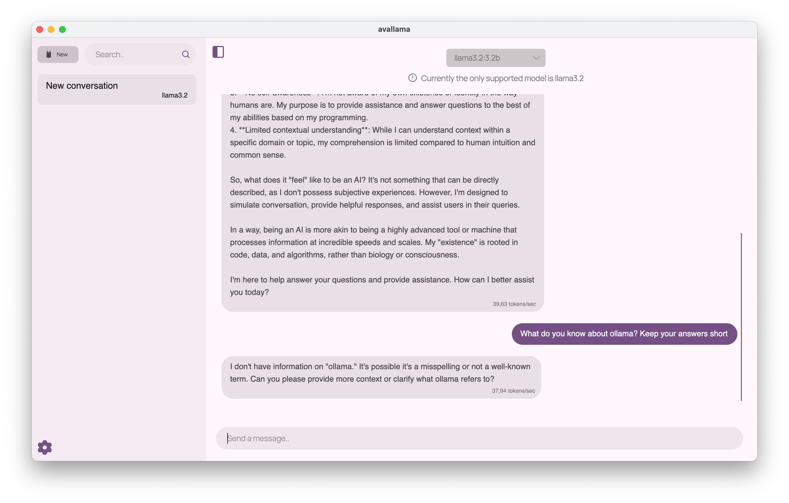
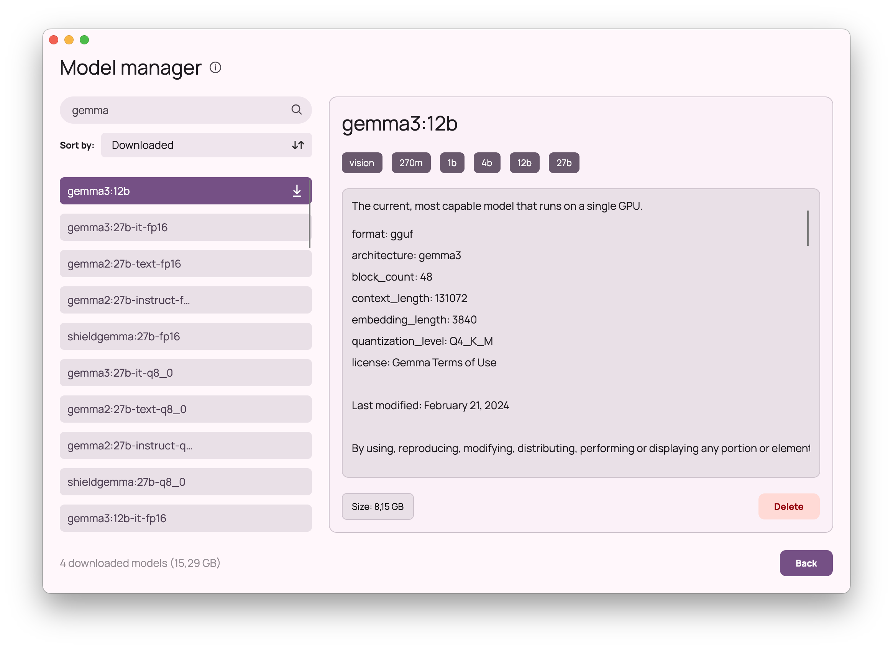

<p align="center">
  
</p>
<h1 align="center">Avallama</h1>

<p align="center">
  <a href="https://github.com/4foureyes/avallama/actions/workflows/pr.yml">
    
  </a>
  <a href="https://codecov.io/gh/4foureyes/avallama">
    
  </a>
</p>


<p align="center">A cross-platform local AI desktop app powered by Ollama</p>

<p align="center">
    
    
</p>

This project is currently being developed by Márk Csörgő and Martin Bartos.

## Features

-  **Seamless Local LLMs** - Chat seamlessly with LLMs hosted locally on your machine
-  **Your Data Stays With You** - Chats are saved to your machine, ensuring your data privacy
-  **Ollama On The Network** – Connect the app to an Ollama instance on your network to easily use your AI workstation on any device
-  **Multi-Platform Support** – Runs on Windows, Linux and macOS utilizing the Avalonia framework
-  **Lightweight and Efficient** – Designed to be minimal while providing a smooth experience
-  **Automatic Ollama Process Management** – Ensures Ollama runs efficiently in the background without manual intervention

## Contributions

We are currently not accepting outside contributions, however we encourage users to report bugs, crashes or any unexpected behaviour. Please see our [Contribution Guidelines](./CONTRIBUTING.md) for more information.


## Installation

**Important notice**: a working installation of Ollama is required for Avallama to work properly. Before installing Avallama on any platform, please download and install Ollama from [this link](https://ollama.com/download).

### Linux

#### Debian/Ubuntu (x64)
1. Download the latest .deb package from the [releases](https://github.com/4foureyes/avallama/releases) page.
2. Open a terminal and navigate to the directory where the file was downloaded, for example:
```bash
cd ~/Downloads
```
3. Install the package using the following command:
```bash
sudo apt install ./avallama_0.2.0_amd64.deb
```
*Replace `./avallama_0.2.0_amd64.deb` with the correct filename of the latest package*

4. After that, you can run the application from the application menu or with the `avallama` command

To uninstall, run:
```bash
sudo apt remove avallama
```

#### Arch Linux (x64)

1. Download the latest .pkg.tar.zst from the Releases tab
2. Open a terminal and navigate to the directory where the file was downloaded.
3. Install the package using the following command:
```bash
sudo pacman -U avallama-0.2.0-1-x86_64.pkg.tar.zst
```
*Replace `avallama-0.2.0-1-x86_64.pkg.tar.zst` with the correct filename of the latest package*


To uninstall run:

```bash
sudo pacman -R avallama
```

To uninstall and remove config files
```bash
sudo pacman -Rns avallama
```

### Windows (x64)

The Windows installer is **not signed with a trusted code-signing certificate**, so Windows SmartScreen may prevent it from running. If you wish to circumvent this, click `More info -> Run anyway`.

1. Download the latest Windows installer from the [releases](https://github.com/4foureyes/avallama/releases) page, e.g. `avallama-setup-0.2.0.exe`.
2. Open the installer and go through the setup steps.
3. Once installed, you can run the application from the Start Menu.

To uninstall, remove it through the `Apps > Installed apps` page in Settings, or navigate to the installation directory and run unins000.exe.

### Windows (arm64)

Windows on Arm is not currently supported.

### macOS

This application is **not signed nor notarized**. MacOS may prevent it from running by default.

1. Download the latest ZIP file from the [releases](https://github.com/4foureyes/avallama/releases) page. (for Intel use *osx_x64*, for Apple Silicon use *osx_arm64*)
2. Double-click on the ZIP file to extract it.
3. Double-click on Avallama to run it.
4. *(Optional) Move the Avallama.app file to the Applications folder using Finder*.

If the '*app is damaged or can't be opened*' error occurs, make sure you remove the quarantine flag of the ZIP file using the following command in the Terminal, and extract it again:
```bash
xattr -d com.apple.quarantine avallama_0.2.0_osx_arm64.zip
```

### Building from source

If you are comfortable building the app from source, feel free to clone the repository and build the application to test out the newest features we are actively implementing.

1. Install the [.NET SDK](https://dotnet.microsoft.com/en-us/download) (version 9.0 or later).
2. Clone the repository: `git clone https://github.com/4foureyes/avallama.git`
3. Navigate to the project directory: `cd avallama`
4. Restore dependencies: `dotnet restore`
5. Build the project: `dotnet build -c Release`
6. Run the application: `dotnet run -c Release --project avallama/avallama.csproj`
7. (Optional) To create a self-contained publish for your platform, run:
```bash
dotnet publish -c Release -r <RID> --self-contained true
```
The output executable will be located in the `avallama/bin/Release/net9.0/<RID>/publish/` directory.

*Replace `<RID>` with your platform's Runtime Identifier, e.g. `win-x64`, `linux-x64`, `osx-arm64`, `osx-x64`*

## Known issues

This is a list of issues we are aware of that will be fixed in a subsequent release. Please do not open new issues for the following known problems, as they are already being addressed.

**All platforms**:
- When using a thinking model, generated conversation titles may be malformed or missing.
- When switching between conversations at the exact moment a title is being generated, the title may not update correctly.
- When switching models mid-conversation, messages may fail to send if the model is not loaded into memory yet.
- Searching through conversations is not yet implemented.
- Markdown and custom tags (e.g. `<think>`) rendering is not yet supported.
- Automatic restarting of the app when changing language settings may not work as expected.

**Linux**:
- When uninstalling, configuration files in `~/.config/avallama` are not removed automatically.
- Ollama process management is not fully functional, as Ollama installs itself as a systemd service.
- When starting the app from a terminal, killing the app prints a stack trace to the terminal.

**macOS**:
- The application installation process is not ideal, as it requires manual extraction from a ZIP file.

## License

This project is licensed under the [MIT License](./LICENSE).
